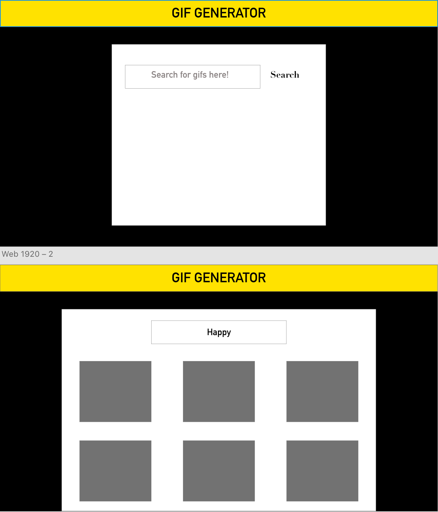

## Lyrics Generator App
This is a wireframe for the app

## Wireframe

### Purpose
This app allows users to search their favorite artists and songs and the lyrics pull right up! Thereby they can follow along with their favorite artists whenever they listen to their songs!

### Third Party Api
https://lyricsovh.docs.apiary.io/#reference/0/lyrics-of-a-song/search

I'll make a searchbar component, Which holds state of what the user typed in to search, and then when they submit their search I will have another component <Results /> that takes that search as a prop and renders the lyrics for the search.